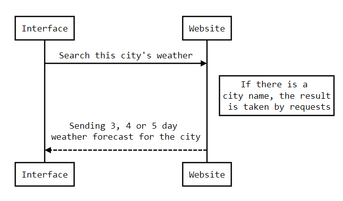

# What Is The Weather Interface
 what is the weather interface for everyone

### What this project has done for me
- I learned how to use pyqt5 commands and QTdesigner
- Using the BeautifulSoup and requests libraries, I learned to send a request to the browser and get the information we want in return. city, temperature, weather etc
- I learned to take precautions against wrong requests that the user may make
- I learned how to make an average design
- This mini-project has contributed a lot to me.

# Follow the steps to run the project 
> #### If you wish, you can look at the visual explanation in the lower pane.

- ### 1- First we need to install `python` .

- ### 2- We need to download the necessary libraries. You can do this by typing the following commands in the terminal.
  - #### `pip install bs4` `pip install requests` `pip install PyQt5`

- ### 3- We open the `havadurumu_console.py` file with python then run file.

- ### 4- After running, the interface will appear. Then we enter the name of the city where we want to know the weather in the box to the left of the `Ara` button. Later click the `Ara` button.

- ### 5- We will see the weather forecast of the city we are looking for for 3, 4 or 5 days. The reason why it is like this is the weather site where I get this information.

- ### 6- Before searching for a new city, I recommend pressing the `Temizle` button to the right of the `Ara` button. The task of the `Temzile` button is to clear the expressions we encounter.

- ### 7- If you forget which city you are viewing as a result of repeated searches, the name of the city you searched is written on the right side of the word `Görüntülenen şehir:` in the lower left pane.

- ### 8- If you want to report a problem, you can report it by pressing the `Bildir` button under the `Ara` button. Or you can contact me directly via my e-mail.

- ### 9- Thanks for your time.
----
# Visual explanation
> ### This is the interface that appears when we run the program.

## Explain of numbers
- ### **1 : Field to enter the name of the city we are looking for**
- ### **2 : The button we will use to search for the city we entered**
- ### **3 : The button where we clear the output in field number 5 for new output**
- ### **4 : The name of the city you searched**
- ### **5 : The weather forecast of the city we are looking for for 3, 4 or 5 days**
- ### **6 : The report button**

## Example views
> ### Searching Ankara

> ### Pressing the report button

> ### After your report, program sending to me a screeenshot of this view and I contact you immediately. 

----
# Tables

## Output Table

| Day  | Weather | Maximum temperature  | Minimum temperature | 
| ------------- | ------------- | ------------- | ------------- | 
| Bugün(Today)  | Güneşli(sunny)  | 33 °C  | 18 °C  | 
| Yarın(Tomorrow)  | Yağmurlu(rainy)  | 27 °C  | 14 °C  | 

## Function Table

| Function name | Description                   |
| ------------- | ------------------------------ |
| `HowIsWeather()`      | **searches the city and prints the returned informations**       |
| `Clear()`   | **Clear the output**     |
| `ShowDialog()`   | **Show report panel**     |
----

# Website interface diagram

----

# **My links**

[Proje linki](https://github.com/NumaIYI/what-is-the-weather-interface)

[Linkedin hesabım](https://tr.linkedin.com/in/ahmed-numan-%C3%A7ift%C3%A7i-96305a243 "Linkedin hesabım")

**Mail adresim : numanbey11@gmail.com**

[Instagram](https://www.instagram.com/ahmednuman.ciftci/)
